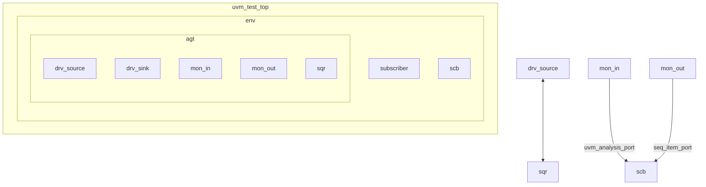
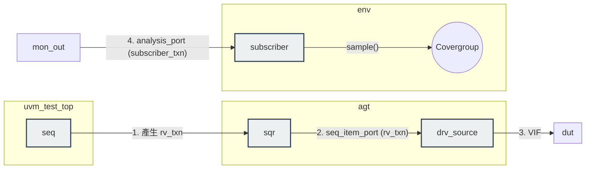

## Simulator
- Cadence Xcelium 25.03
- Options used: `-access +rw -seed random -coverage functional`

## Run
```bash
cd sim
make TEST=rv_test SEED=random COV=1
# or
./run_xrun.sh rv_test random


### UVM 環境架構圖




